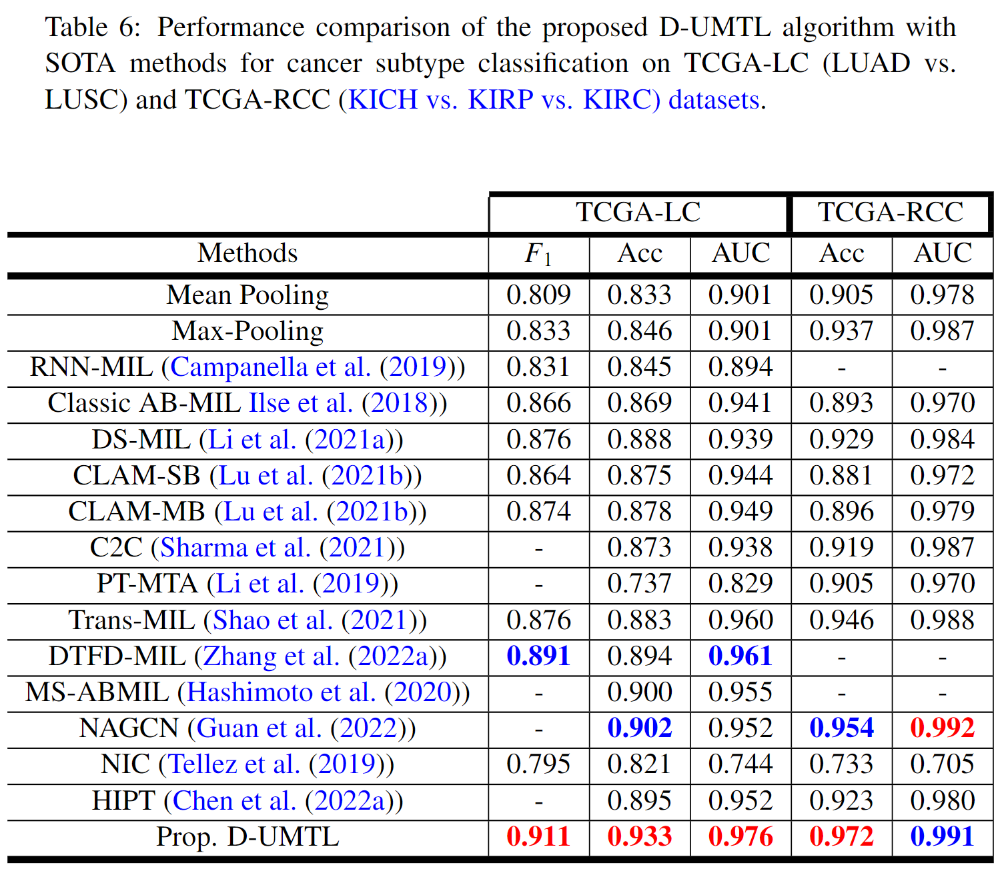

# UMTL

Unsupervised Mutual Transformer Learning for Gigapixel Whole Slide Image Classification

***Abstract** The classification of gigapixel Whole Slide Images (WSIs) is an important task in the emerging area of computational pathology. There has been a surge of interest in deep learning models for WSI classification with clinical applications such as cancer detection or prediction of cellular mutations. Most supervised methods require expensive and labor-intensive manual annotations by expert pathologists. Weakly supervised Multiple Instance Learning (MIL) methods have recently demonstrated excellent performance;
however, they still require large-scale slide-level labeled training datasets that require a careful inspection of each slide by an expert pathologist. In this work, we propose a fully unsupervised WSI classification algorithm based on mutual transformer learning. The instances (i.e., patches) from gigapixel WSIs are transformed into a latent space and then inverse-transformed to the original space. Using the transformation loss, pseudo labels are generated and cleaned using a transformer label cleaner. The proposed transformer-based pseudo-label generator and cleaner modules mutually train each other iteratively in an unsupervised manner. A discriminative learning mechanism is introduced to improve normal versus cancerous instance labeling. In addition to the unsupervised learning, we demonstrate the effectiveness of the proposed framework for weakly supervised learning and cancer subtype classification as downstream analysis. Extensive experiments on four publicly available datasets show better performance of the proposed algorithm compared to the existing state-of-the-art methods.*

##  UMTL System diagram 


Training Process: (a) Shows the unlabeled WSIs, (b) instances of size 224 × 224 × 3 pixels are extracted, (c) feature extraction head, (d) Transformer Pseudo-Label Generator (TPLG), (e) Transformer pseudo-Label Cleaner (TLC)


## Results
Performance comparison of the proposed algorithm with SOTA methods on the testing splits of CAMELYON-16, TCGALC, and TCGA-RCC datasets. CAMELYON-16 test-set is evaluated for cancer vs. normal WSI classification. TCGA-LC is evaluated for LUAD vs. LUSC WSI subtype cancer classification. TCGA-RCC is evaluated for multi-class cancer subtypes (KIRCH, KIRP, or KIRC) WSI classification


## Requirements

- python 3
- pytorch == 1.4.0
- torchvision

## Funding
This work was funded by 

## Reference
If you find our work useful in your research or if you use parts of this code please consider citing our [paper]():


```
@article{,
  title={Data-efficient and weakly supervised computational pathology on whole-slide images},
  author={},
  journal={},
  volume={},
  number={},
  pages={},
  year={},
  publisher={}
}
```
