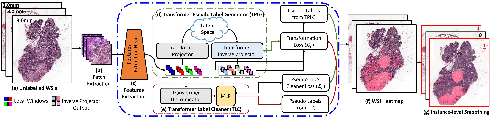

# UMTL

Unsupervised Mutual Transformer Learning for Gigapixel Whole Slide Image Classification

***Summary** In this work, we propose a fully unsupervised WSI classification algorithm based on mutual transformer learning. Instances from gigapixel WSI (i.e., image patches) are transformed into a latent space and then inverse-transformed to the original space. Using the transformation loss, pseudo-labels are generated which are then cleaned using a transformer label-cleaner. The proposed transformer-based pseudolabel generation and cleaning modules mutually train each other iteratively in an unsupervised manner. A discriminative learning mechanism is introduced to improve normal versus cancerous instance labeling. In addition to unsupervised classification, we demonstrate the effectiveness of the proposed framework for weak supervision for cancer subtype classification as downstream analysis. Extensive experiments on four publicly available datasets show excellent performance compared to the state-of-the-art methods.*

##  UMTL System diagram 

(a) Shows the unlabeled WSIs, (b) instances of size 224 × 224 × 3 pixels are extracted, (c) feature extraction head, (d) Transformer Pseudo-Label Generator (TPLG), (e) Transformer pseudo-Label Cleaner (TLC), (f) predicted WSI map where red region shows the positive instances, (g) instance-level label smoothing and slide-level label prediction steps.

